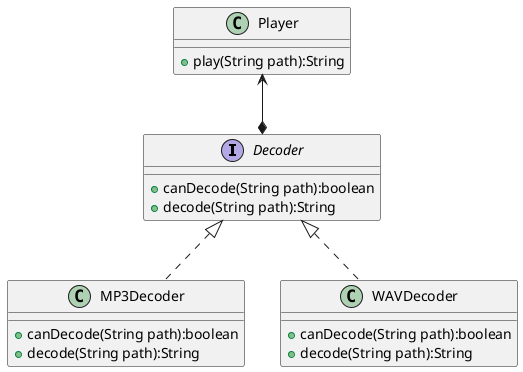
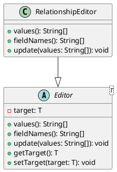
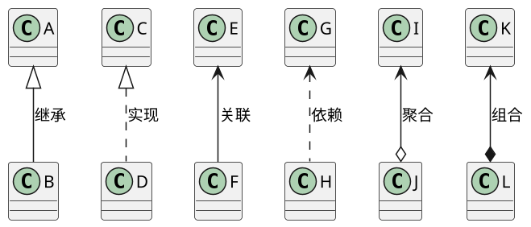

# 1 验证性内容学习情况自查

完成实验1的第2部分内容的学习。

1. 是否完成2.1部分内容，理解抽象类的基本概念和用法？
是
2. 是否完成2.2部分内容，理解抽象函数的概念与用法？
是
3. 是否完成2.3部分内容，理解接口的概念和用法？
是
4. 是否完成2.4部分内容，理解多态的概念和用法？
是
5. 是否存在其他问题？
无

# 2 类图

1. 实验3.1的类图

2. 实验3.2的类图

# 3 符号提示

